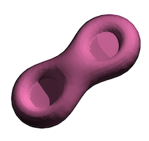

# Topology control of volumetric data
James Vanderhyde, PhD Dissertation, Georgia Tech 2007

Three-dimensional scans and other volumetric data sources often result in representations that are more complex topologically than the original model. The extraneous critical points, handles, and components are called topological noise. The key to this thesis is that the global topology of volumetric data sets is determined by local changes at individual points. 

In this thesis we describe variations on the local topology check for use in different settings. We use the topology simplification procedure to extract a single component with controlled topology from an isosurface in volume data sets and partially-defined volume data sets. We also use it to remove critical points from three-dimensional volumes, as well as time-varying volumes. We have applied the technique to two-dimensional (plus time) data sets and three dimensional (plus time) data sets.

For more information, please look up the dissertation here:
https://smartech.gatech.edu/handle/1853/16215

This repository contains the source code used in the project. The code has not been looked at since 2007 and is not in active development. MIT license.

Relevant publications:
1. “Extraction of Topologically Simple Isosurfaces from Volume Datasets,” A. Szymczak and J. Vanderhyde, IEEE Visualization 2003.
2. “Topological simplification of isosurfaces in volumetric data using octrees,” J. Vanderhyde and A. Szymczak, Graphical Models, 2008.
3. “Airway segmentation by topology-driven local thresholding,” A. Szymczak and J. Vanderhyde, SPIE Medical Imaging, 2008.

  
